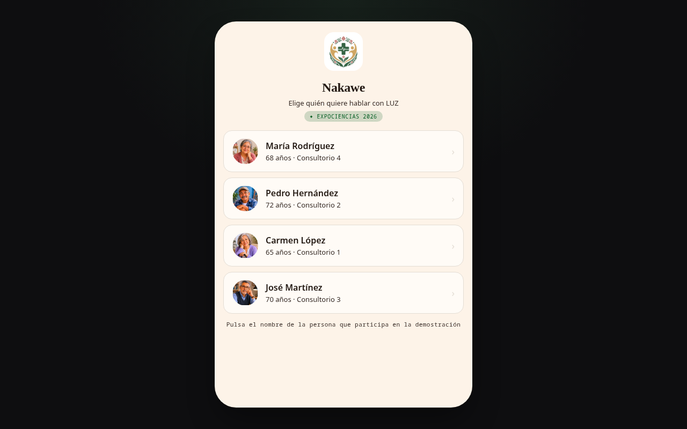
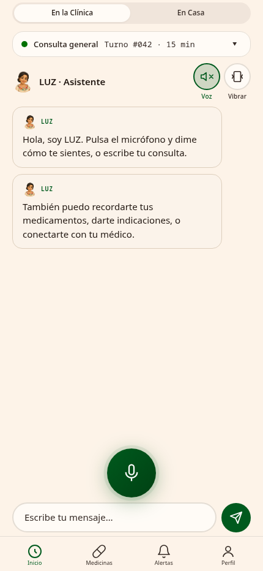
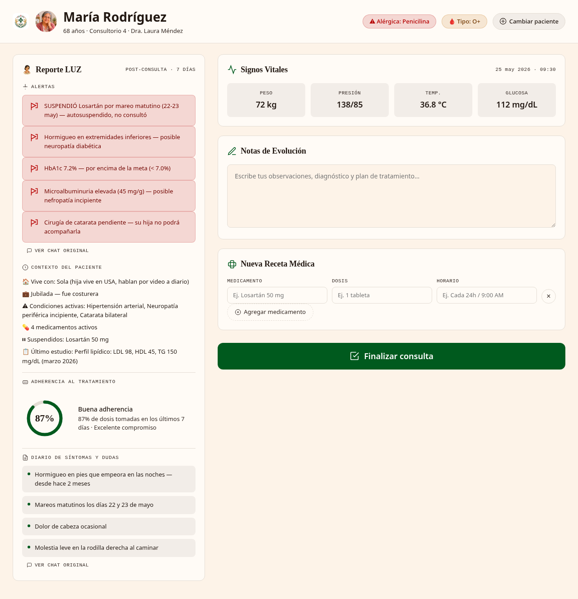
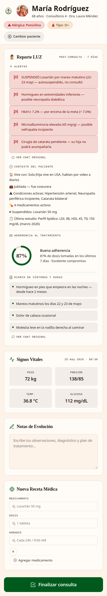
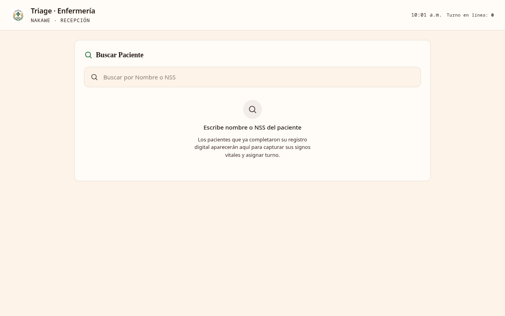

# Nakawe — Digital Health Assistant

> **⚠️ ExpoCiencias 2026 Prototype** — This was a rapid prototype (48–72 hours) built for ExpoCiencias 2026. For production, the architecture would be fundamentally different — see [Production Vision](#production-vision) below.

Digital health system for ExpoCiencias 2026. Patients scan a QR code, open the PWA on their phone, and interact with **LUZ**, the conversational health assistant.

## Screenshots

### Patient — Selection

### Patient — Chat with LUZ

### Doctor Dashboard

### Doctor — Mobile

### Triage — Nursing

## Views

| View | File | Description |
|------|------|-------------|
| Patient | `index.html` | Main PWA — patient portal with LUZ chat, medications, and profile |
| Doctor | `doctor.html` | Doctor dashboard with LUZ report, vitals, prescriptions |
| Triage | `triage.html` | Nursing dashboard — patient search, vitals, classification |

## PWA

Scan the QR code or open `https://phyton06.github.io/Nakawe/` from your phone.
The browser will offer to install the app on your home screen.

## Stack (Prototype)

- HTML + CSS vanilla (no frameworks)
- **Palette**: OKLCH, cream and deep green tones
- **Typography**: Iowan Old Style (display), SF Pro Text (UI)
- **Icons**: Inline SVG
- **Assets**: PNG / JPEG in `assets/images/`

## Patients

| # | Name | Age | Office | Doctor |
|---|------|-----|--------|--------|
| 1 | **María Rodríguez** | 68 | 4 | Dra. Laura Méndez |
| 2 | **Pedro Hernández** | 72 | 2 | Dr. Roberto García |
| 3 | **Carmen López** | 65 | 1 | Dra. Laura Méndez |
| 4 | **José Martínez** | 70 | 3 | Dr. Roberto García |

### Clinical Summary

- **María**: T2D + HTN + peripheral neuropathy. Withheld Losartán due to dizziness. HbA1c 7.2%.
- **Pedro**: Ischemic heart disease (stent 2022) + COPD. Reported brief chest pain. Glucose 156 mg/dL.
- **Carmen**: Right hip fracture (Feb 2026) + osteoporosis. Withheld antibiotics due to gastritis. Adherence 72%.
- **José**: Recently retired. First check-up in 10 years. LDL 145. Mild SAOS + digital hypochondria.

### Patient Data

Full patient profiles (chronic conditions, medications, surgeries, hospitalizations, family history, studies, vitals, and alerts) are defined in `js/pacientes.js`, loaded by `index.html`, `doctor.html`, and `triage.html`. This file feeds the **LUZ system prompt** and the doctor dashboard with detailed clinical context.

The `Historial_pacientes.md` document contains full summaries for printing on banners.

## Data

| File | Purpose |
|------|---------|
| `js/pacientes.js` | Full profiles for all 4 patients (shared) |
| `js/gemini-config.js` | Gemini API key (gitignored) |
| `js/gemini-config.example.js` | Configuration template |
| `Historial_pacientes.md` | Summaries for banner printing |

---

## Production Vision

This prototype validated the concept at ExpoCiencias 2026. A production version with more time would use a fundamentally different architecture:

| Aspect | Prototype | Production |
|--------|-----------|------------|
| Framework | Vanilla HTML/CSS/JS | **Nuxt 3 + PWA (TypeScript)** |
| Backend | None (client-side data) | **Supabase** (real-time DB, auth, push notifications) |
| Offline | None | **Service Workers** for partial offline support |
| Accessibility | Basic | **Web Speech API + Vibration API** for haptic/voice alerts |
| AI (LUZ) | Gemini prompt | **NLG engine** — entity extraction, medical→plain language translation |
| Real-time queue | Simulated | **WebSocket-based** live queue with push notifications |
| QR access | Static links | **Dynamic QR per patient** generated at check-in |

### Problem Statement

The absence of real-time visibility and proactive follow-up in clinics creates an "Information Gap" that disconnects medical service quality from patient care perception.

**Evidence:**
- 60% of patients in Mexico report unclear post-consultation instructions (ENSANUT 2023)
- 97.2% of Mexican internet users access via smartphone (ENDUTIH 2023) — validates PWA over native apps

### Key Metrics (Target)

- **Adherence**: >70% engagement at first weekly check-in
- **Efficiency**: 15% reduction in reception questions
- **Optimization**: 30 seconds saved per consultation via digital triage

### Tech Stack (Production)

- **Nuxt 3 & PWA (TypeScript)** — Instant access via QR, no app store friction
- **Service Workers** — Partial offline in low Wi-Fi zones
- **Web Speech / Vibration APIs** — Accessible alerts for vulnerable populations
- **LUZ AI Engine** — NLG models to translate medical text into plain, actionable language
- **Supabase** — Real-time DB + SDK for Nuxt 3, no complex server architecture

---

🇪🇸 Español

# Nakawe — Asistente de Salud Digital

> **⚠️ Prototipo ExpoCiencias 2026** — Este fue un prototipo rápido (48–72 horas) construido para ExpoCiencias 2026. Para producción, la arquitectura sería fundamentalmente diferente — ver [Visión de Producción](#visión-de-producción) más abajo.

Sistema de salud digital para ExpoCiencias 2026. Los pacientes escanean un código QR, abren la PWA en su celular, e interactúan con **LUZ**, el asistente de salud conversacional.

## Capturas

### Paciente — Selección

### Paciente — Chat con LUZ

### Dashboard Médico

### Doctor — Móvil

### Triage — Enfermería

## Vistas

| Vista | Archivo | Descripción |
|-------|---------|-------------|
| Paciente | `index.html` | PWA principal — portal del paciente con chat LUZ, medicamentos y perfil |
| Médico | `doctor.html` | Dashboard médico con reporte LUZ, signos vitales, recetas |
| Triage | `triage.html` | Dashboard de enfermería — búsqueda de pacientes, signos vitales, clasificación |

## PWA

Escaneá el código QR o abrí `https://phyton06.github.io/Nakawe/` desde tu celular.
El navegador te va a ofrecer instalar la app en tu pantalla de inicio.

## Stack (Prototipo)

- HTML + CSS vanilla (sin frameworks)
- **Paleta**: OKLCH, tonos crema y verde profundo
- **Tipografía**: Iowan Old Style (display), SF Pro Text (UI)
- **Iconos**: SVG inline
- **Assets**: PNG / JPEG en `assets/images/`

## Pacientes

| # | Nombre | Edad | Consultorio | Médico |
|---|--------|------|-------------|--------|
| 1 | **María Rodríguez** | 68 | 4 | Dra. Laura Méndez |
| 2 | **Pedro Hernández** | 72 | 2 | Dr. Roberto García |
| 3 | **Carmen López** | 65 | 1 | Dra. Laura Méndez |
| 4 | **José Martínez** | 70 | 3 | Dr. Roberto García |

### Resumen Clínico

- **María**: DM2 + HAS + neuropatía periférica. Suspendió Losartán por mareo. HbA1c 7.2%.
- **Pedro**: Cardiopatía isquémica (stent 2022) + EPOC. Reportó dolor torácico breve. Glucosa 156 mg/dL.
- **Carmen**: RTC cadera derecha (feb 2026) + osteoporosis. Suspendió antibiótico por gastritis. Adherencia 72%.
- **José**: Recién jubilado. Primer check-up en 10 años. LDL 145. SAOS leve + hipocondría digital.

### Data de Pacientes

Los perfiles completos de los pacientes (condiciones crónicas, medicamentos, cirugías, hospitalizaciones, antecedentes familiares, estudios, signos vitales y alertas) se definen en `js/pacientes.js`, que es cargado por `index.html`, `doctor.html` y `triage.html`. Este archivo alimenta el **system prompt de LUZ** y el dashboard médico con contexto clínico detallado.

El documento `Historial_pacientes.md` contiene los resúmenes completos para impresión en lonas/carteles.

## Data

| Archivo | Propósito |
|---------|-----------|
| `js/pacientes.js` | Perfiles completos de los 4 pacientes (compartido) |
| `js/gemini-config.js` | API key de Gemini (gitignored) |
| `js/gemini-config.example.js` | Template de configuración |
| `Historial_pacientes.md` | Resúmenes para impresión en lonas |

---

## Visión de Producción

Este prototipo validó el concepto en ExpoCiencias 2026. Una versión de producción con más tiempo usaría una arquitectura fundamentalmente diferente:

| Aspecto | Prototipo | Producción |
|---------|-----------|------------|
| Framework | HTML/CSS/JS vanilla | **Nuxt 3 + PWA (TypeScript)** |
| Backend | Sin backend (datos en cliente) | **Supabase** (DB en tiempo real, auth, push notifications) |
| Offline | Sin soporte | **Service Workers** para funcionalidad parcial sin conexión |
| Accesibilidad | Básica | **Web Speech API + Vibration API** para alertas hápticas/voz |
| IA (LUZ) | Prompt a Gemini | **Motor NLG** — extracción de entidades, traducción médico→lenguaje claro |
| Cola en tiempo real | Simulada | **WebSocket** con notificaciones push |
| Acceso QR | Links estáticos | **QR dinámico por paciente** generado en check-in |

### Planteamiento del Problema

La ausencia de un sistema de visibilidad en tiempo real y seguimiento proactivo en la clínica genera un "Abismo Informativo" que desconecta la calidad del servicio médico de la percepción de atención del paciente.

**Evidencia:**
- 60% de pacientes en México reporta falta de claridad en instrucciones post-consulta (ENSANUT 2023)
- 97.2% de internautas mexicanos accede mediante smartphone (ENDUTIH 2023) — valida PWA sobre apps nativas

### Métricas Clave (Objetivo)

- **Adherencia**: >70% de engagement en el primer check-in semanal
- **Eficiencia**: 15% de reducción en preguntas de recepción
- **Optimización**: 30 segundos ahorrados por consulta vía triage digital

### Tech Stack (Producción)

- **Nuxt 3 & PWA (TypeScript)** — Acceso instantáneo vía QR, sin fricción de app store
- **Service Workers** — Funcionalidad parcial offline en zonas de baja cobertura Wi-Fi
- **Web Speech / Vibration APIs** — Alertas accesibles para poblaciones vulnerables
- **Motor IA LUZ** — Modelos NLG para traducir texto médico a lenguaje claro y accionable
- **Supabase** — DB en tiempo real + SDK para Nuxt 3, sin arquitectura de servidor compleja

